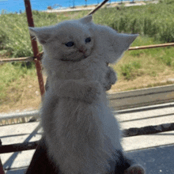

# Bullet-Game
🕹️ Title & Hook:
Bullet Shift, it connects to a mechanic in the game where you can shift to and from a bullet.

---

🕹️ Genre:
Endless, shooting, puzzle game

---

🕹️ Backstory:
You are an indivudal named Rekab who was cursed by an evil wizard to be turned into a bullet, unable to turn yourself back into a human besides brief 5-second periods of time. You are trying to reach the end of a tunnel that the wizard created to entrap you, however you are unprepared for the true perils you will face.

---

🕹️ Characters:
Protagonist - Rekab, brother of Roxum and Leggy Jorington, not able to see his physical appearance, but seems very intelligent.
Antagonist - Evil wizard Gerald, brother of nobody, who just really doesn't like the Jorington family.

---

🕹️ Target Market / Audience:
People would enjoy the game for the story, along with the interesting puzzles that lead you to the 'end' of the game.

---

🕹️ Player Motivations:
The player would be motivated through perceived 'levels' that they are trying to complete in order to advance the story, however, they will soon realize that there is no end.

---

🕹️ Unique Selling Point (USP):
Special mechanics in which you can turn from a bullet into a human for a short period of time, along with other people who suffered the same fate as Rekab.

---

🕹️ Inspirations & Competition:
TABS art style,
Super Hot

---

🕹️ Goals:
The game should make the user feel engaged and to have fun playing it, along with interested in the story.

